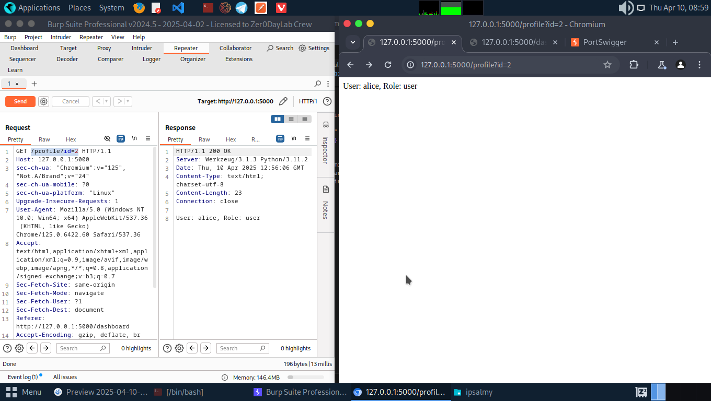
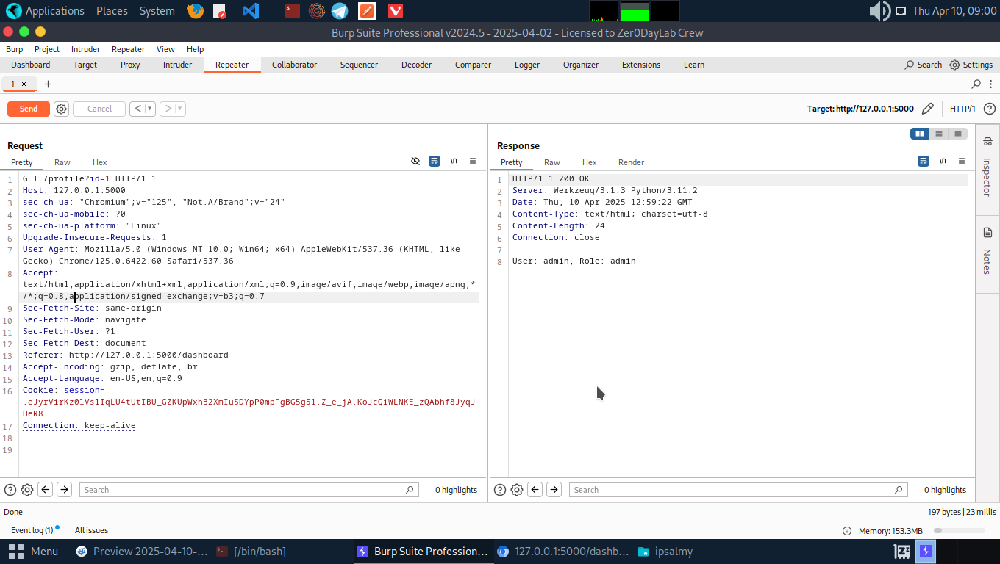

# Explaining and Exploiting Broken Access Control Vulnerability

Using the vulnerable flask code from ==> **https://github.com/DghostNinja/BreakTheFlask.git**

```python
from flask import Flask, request, redirect, session, send_from_directory, abort
import os

app = Flask(__name__)
app.secret_key = "devkey"

users = {
    "admin": {"password": "adminpass", "role": "admin", "id": 1},
    "alice": {"password": "alice123", "role": "user", "id": 2},
    "bob": {"password": "bob123", "role": "user", "id": 3}
}

UPLOAD_FOLDER = "uploads"
os.makedirs(UPLOAD_FOLDER, exist_ok=True)

@app.route('/')
def home():
    if 'username' in session:
        return f"Logged in as {session['username']} (Role: {session['role']})"
    return "Welcome! Please login at /login"

@app.route('/login', methods=['GET', 'POST'])
def login():
    if request.method == 'POST':
        u = request.form['username']
        p = request.form['password']
        if u in users and users[u]['password'] == p:
            session['username'] = u
            session['role'] = users[u]['role']
            session['user_id'] = users[u]['id']
            return redirect('/dashboard')
        return "Invalid credentials"
    return '''
        <form method="post">
            Username: <input name="username"><br>
            Password: <input name="password" type="password"><br>
            <input type="submit" value="Login">
        </form>
    '''

@app.route('/dashboard')
def dashboard():
    if 'username' not in session:
        return redirect('/login')
    return f'''
        <h2>Welcome, {session['username']}</h2>
        <ul>
            <li><a href="/profile?id={session['user_id']}">View Profile (IDOR)</a></li>
            <li><a href="/files/{session['username']}.txt">Download Your File</a></li>
            <li><a href="/admin_panel">Admin Panel</a></li>
        </ul>
    '''

@app.route('/profile')
def profile():
    uid = int(request.args.get('id'))
    for user, data in users.items():
        if data['id'] == uid:
            return f"User: {user}, Role: {data['role']}"
    return "User not found"

@app.route('/files/<path:filename>')
def download_file(filename):
    return send_from_directory(UPLOAD_FOLDER, filename)

@app.route('/admin_panel')
def admin_panel():
    return "Welcome to Admin Panel! You should not be here unless you're admin."

@app.route('/change_role', methods=['POST'])
def change_role():
    if 'username' not in session:
        return redirect('/login')
    new_role = request.form.get('role')
    session['role'] = new_role
    return f"Your role has been changed to {new_role} (Insecure!)"

if __name__ == '__main__':
    open(os.path.join(UPLOAD_FOLDER, "alice.txt"), "w").write("Alice's Secret Data")
    open(os.path.join(UPLOAD_FOLDER, "bob.txt"), "w").write("Bob's Notes")
    open(os.path.join(UPLOAD_FOLDER, "admin.txt"), "w").write("Top Secret Admin Data")

    app.run(debug=True, host='0.0.0.0', port=5000)

```

## 1. Insecure coding 
```python
app = Flask(__name__)
app.secret_key = "devkey"

users = {
    "admin": {"password": "adminpass", "role": "admin", "id": 1},
    "alice": {"password": "alice123", "role": "user", "id": 2},
    "bob": {"password": "bob123", "role": "user", "id": 3}
}
```
* From the code we can see the harcoded credentials of Admin, Alice and Bob. This is an unsafe coding practice, as we can use the credentials to login into victim's account and gain access to their information. 


## 2. Insecure Direct Object Reference (IDOR)
**Vulnerable:**
```python
@app.route('/profile')
def profile():
    uid = int(request.args.get('id'))
    for user, data in users.items():
        if data['id'] == uid:
            return f"User: {user}, Role: {data['role']}"
```
---

* Log in into user B's account(Alice) since we already got the credentials from the source code. Then, try to view the user's profile from the dashboard and from there we see a *GET* request being sent with the user's ID in the request.



* We can se admin has an ID of 1. We can change the request id to that and by doing this we have access to information on the admin profile.

```bash
GET /profile?id=1  → View admin’s profile

```


### Fix:

Validate that the requested ID matches the currently logged-in user:
```python
@app.route('/profile')
def profile():
    if 'user_id' not in session:
        return redirect('/login')
    requested_id = int(request.args.get('id'))
    if requested_id != session['user_id']:
        abort(403)
    user = session['username']
    role = session['role']
    return f"User: {user}, Role: {role}"

```

## 3. Path Traversal

**Vulnerable Code:**
```python
@app.route('/files/<path:filename>')
def download_file(filename):
    return send_from_directory(UPLOAD_FOLDER, filename)

```
